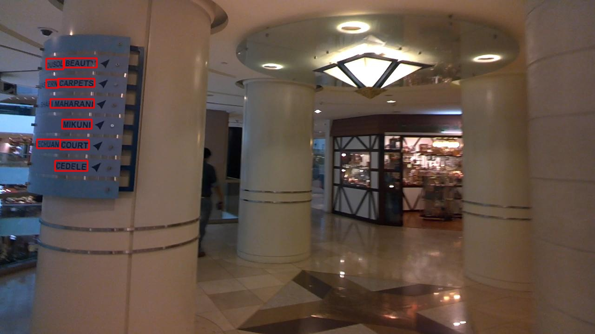

# 介绍
本项目基于paddlepaddle框架复现PSENet，PSENet是一种新的实例分割网络，它有两方面的优势。 首先，psenet作为一种基于分割的方法，能够对任意形状的文本进行定位。其次，该模型提出了一种渐进的尺度扩展算法，该算法可以成功地识别相邻文本实例。


参考论文：
- [1] W. Wang, E. Xie, X. Li, W. Hou, T. Lu, G. Yu, and S. Shao. Shape robust text detection with progressive scale expansion network. In Proc. IEEE Conf. Comp. Vis. Patt. Recogn., pages 9336–9345, 2019.<br>

参考项目：
- [https://github.com/whai362/PSENet](https://github.com/whai362/PSENet)

项目aistudio地址：
- [整理后推出](整理后退出)

# 对比
本项目基于paddlepaddle深度学习框架复现，对比于作者论文的代码：
- 我们将提供更加细节的训练流程，以及更加全面的预训练模型。
- 我们将提供基于aistudio平台可在线运行的项目地址，您不需要在您的机器上配置paddle环境可以直接浏览器在线运行全套流程。
- 我们的提供模型在total_text数据集上超越原作者论文最好模型3%左右，在ICDAR2015数据集上超过作者开源的模型3%左右（差作者未公开的论文模型0.6%）。
- 模型速度上，在total_text数据集上FPS达到10.1是作者论文的2.5倍左右，在ICDAR2015上FPS为1.8与作者论文的FPS1.6相当。

# 运行
## 安装依赖
```bash
sh init.sh
```

## 编译pse
因为原作者提供了cpp的pse代码加速后处理的过程，所以需要编译，注意在aistudio上我们已经打包了编译好的，不需要执行这一步~
```bash
sh compile.sh
```
如果实在编译不成功可以使用提供的python版本的pse代码：
[pypse.py](./models/pypse.py)


## 训练：
```bash
python3 train.py ./config/psenet/psenet_r50_ic15_1024_Adam.py
```
如果训练中断通过 --resume 参数恢复，例如使用上述命令在第44epoch第0iter中断则：
```bash
python3 train.py ./config/psenet/psenet_r50_ic15_1024_Adam.py --resume checkpoint_44_0 # 不是断点参数的绝对路径请注意
```
如果你想分布式训练并使用多卡：
```bash
python3 -m paddle.distributed.launch --log_dir=./debug/ --gpus '0,1,2,3' train.py config/psenet/psenet_r50_ic17_1024_Adam.py
```

## 测试：
```bash
python3 test.py ./config/psenet/psenet_r50_ic15_1024_Adam.py ./checkpoints/psenet_r50_ic15_1024_Adam/checkpoint_491_0.pdparams --report_speed
```
! 测试需要注意测试配置与测试的参数文件相同，不然指标会掉很多

## 评估：
ICDAR2015评估
```bash
cd eval
sh eval_ic15.sh
```

total_text评估(注意tt数据集的评估需要使用python2，如果你在aistudio上使用我们的项目我们提供了打包的python可以直接执行详情见eval_tt.sh文件)
```bash
cd eval
sh eval_tt.sh
```
# 细节
>该列指标在ICDAR2015的测试集测试

train from scratch细节：


| |epoch|opt|short_size|batch_size|dataset|memory|card|precision|recall|hmean|FPS|config|
| :---: | :---: | :---: | :---: | :---: | :---: | :---: | :---: | :---: | :---: | :---: | :---: | :---: |
|pretrain_1|33|Adam|1024|16|ICDAR2017|32G|1|0.68290|0.68850|0.68569|5.0|[psenet_r50_ic17_1024.py](./config/psenet/psenst_r50_ic17_1024.py)|
|pretrain_2|46|Adam|1024|16|ICDAR2013、ICDAR2017、COCO_TEXT|32G|4|0.69678|0.69812|0.69745|5.0|[psenet_r50_ic17_1024.py](./config/psenet/psenst_r50_ic17_1024.py)|
|pretrain_3|68|Adam|1260|16|ICDAR2013、ICDAR2015、ICDAR2017、COCO_TEXT|32G|1|0.86526|0.80693|0.83508|2.0|[psenet_r50_ic17_1260.py](./config/psenet/psenet_r50_ic17_1260.py)|


## ICDAR2015
>该列指标在ICDAR2015的测试集测试

训练细节：

| |pretrain|epoch|opt|short_size|batch_size|dataset|memory|card|precision|recall|hmean|FPS|config|
| :---: | :---: | :---: | :---: | :---: | :---: | :---: | :---: | :---: | :---: | :---: | :---: | :---: | :---: |
|finetune_1|pretrain_1|491|Adam|1024|16|ICDAR2015|32G|1|0.86463|0.80260|0.83246|5.0|[finetune1.py](./config/psenet/finetune1.py)|
|finetune_2|pretrain_3|-|Adam|1260|16|ICDAR2015|32G|1|0.87024|0.81367|0.84101|2.0|[finetune2.py](./config/psenet/finetune2.py)|
|finetune_3|finetune_2|401|SGD|1480|16|ICDAR2015|32G|1|<font color='red'>0.88060</font>|<font color='red'>0.82378</font>|<font color='red'>0.85124</font>|<font color='red'>1.8</font>|[finetune3.py](./config/psenet/finetune3.py)|

## Total_text
>该列指标在Total_Text的测试集测试

训练细节：

| |pretrain|epoch|opt|short_size|batch_size|dataset|memory|card|precision|recall|hmean|FPS|config|
| :---: | :---: | :---: | :---: | :---: | :---: | :---: | :---: | :---: | :---: | :---: | :---: | :---: | :---: |
|finetune_1|None|331|Adam|736|16|Total_Text|32G|1|0.84823|0.76007|0.80173|10.1|[psenet_r50_tt.py](./config/psenet/psenet_r50_tt.py)|
|finetune_2|pretrain_2|290|Adam|736|16|Total_Text|32G|1|<font color='red'>0.88482</font>|<font color='red'>0.79002</font>|<font color='red'>0.83474</font>|<font color='red'>10.1</font>|[psenet_r50_tt_finetune2.py](./config/psenet/psenet_r50_tt_finetune2.py)|

# 模型下载
模型地址：
[谷歌云盘](https://drive.google.com/drive/folders/1Xf5NsmxseygbDKYLBgSZcnvy4fRq6ZzY?usp=sharing)

模型对应：

|name|path|
| :---: | :---: |
|pretrain_1|psenet_r50_ic17_1024_Adam/checkpoint_33_0|
|pretrain_2|psenet_r50_ic17_1024_Adam/checkpoint_46_0|
|pretrain_3|psenet_r50_ic17_1260_Adam/checkpoint_68_0|
|ic15_finetune_1|psenet_r50_ic15_1024_Adam/checkpoint_491_0|
|ic15_finetune_2|psenet_r50_ic15_1260_Adam/best|
|ic15_finetune_3|psenet_r50_ic15_1480_SGD/checkpoint_401_0|
|tt_finetune_1|psenet_r50_tt/checkpoint_331_0|
|tt_finetune_2|psenet_r50_tt/checkpoint_290_0|

# 部分识别效果



